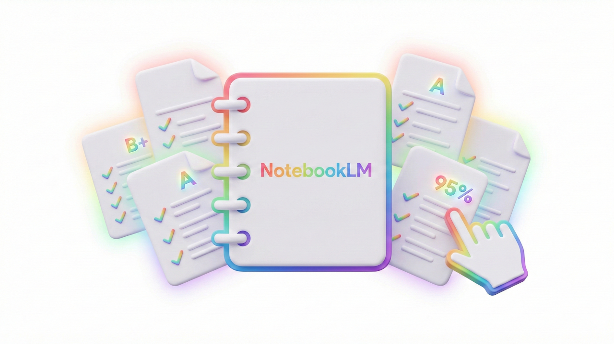

## Assessments

<iframe src="https://drive.google.com/file/d/1l7XDrhZJvdAUx6604LMRH_hVpsbf4Wdx/preview?authuser=0"></iframe>

## From Grading Fatigue to Instant Feedback 🎓

The Challenge: The Feedback Bottleneck The most significant bottleneck in instructional excellence is the "feedback loop." By the time a teacher manually grades 150 essays, students have often moved on to the next topic, making the feedback less effective for immediate growth.

The Solution: Moving from "Grader" to "Instructional Reviewer" Using Gemini as a feedback assistant allows for immediate, rubric-aligned insights. This workflow shifts the educator’s role from the time-consuming task of initial sorting to the high-value role of Reviewer and Facilitator, ensuring every student receives specific, actionable advice while the learning is still fresh.

The Workflow Showcase

- Collection: Students submit open-ended responses via Google Forms, which automatically aggregate data into Google Sheets.
- Analysis: The sheet is processed by Gemini using a specific, teacher-provided prompt that includes the exact HCPSS-aligned rubric and standards.
- Output: Gemini generates a personalized feedback paragraph for every student, identifying specific strengths and target areas for improvement based on the data.

Key Benefits

- Consistency: The AI applies the same rubric criteria to the first student and the last, eliminating "grader fatigue" and ensuring objective alignment.
- Instructional Speed: Reduces administrative grading time by up to 90%, reclaiming hours for 1:1 student support and small-group interventions.
- Personalization: Every student receives detailed, high-quality feedback, moving beyond generic comments to provide true individualized support.

HCPSS Strategic Plan Alignment

This assessment workflow serves as a primary driver for institutional goals by transforming the speed and quality of student-teacher interactions.

- Priority 1: Strengthen Learning and Instruction: This initiative directly addresses Outcome 1.3 (Instructional Excellence). By accelerating the feedback cycle, we provide "just-in-time" insights that allow students to correct misconceptions immediately, directly correlating to improved student achievement.
- Priority 3: Staff Growth & Engagement: By streamlining the labor-intensive assessment process, we operationalize the district’s commitment to "reimagining time." Reducing the administrative burden of manual grading protects educator well-being and mitigates the primary drivers of professional burnout.

Key Impact: This transition from "manual grading" to "instructional review" ensures that every student receives a high-quality, personalized response without increasing the workload on school staff.

## NotebookLM Sandbox

Attached is a Notebook from the video where you can experiment with using what was discussed in the video!

[NotebookLM Sandbox](https://notebooklm.google.com/notebook/e6c7ed61-cebb-4a4a-826b-f24488443af9)

