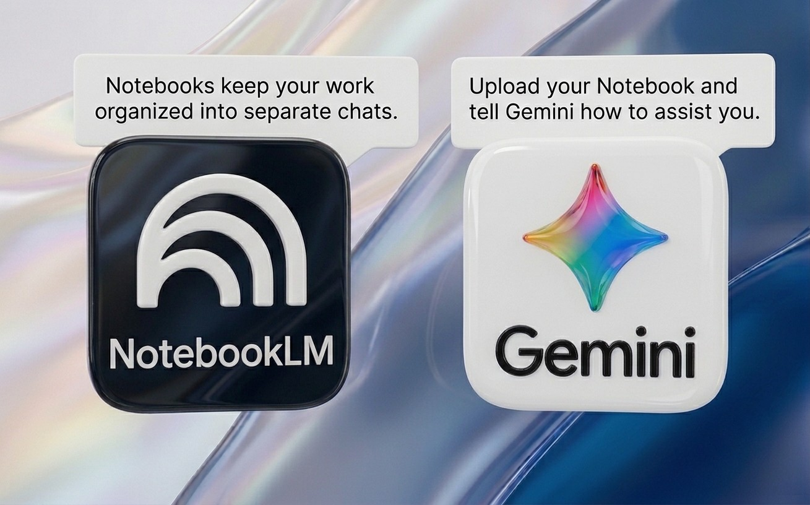

<!-- The hero (portrait, name, "Innovation. Guided by Pedagogy.", intro line, and
     Resume / LinkedIn / Email actions) is rendered by the Hero.tsx component
     above the page body. Each section below is wrapped in a .home-panel div;
     custom.scss alternates the panels between dark and light surfaces
     (Apple-style contrast bands) via :nth-of-type, so keep the order in mind
     when adding sections: odd panels render dark, even panels render light. -->

### ✨ Gemini &amp; NotebookLM

- [[Intro to Gemini & NotebookLM|AI Workflows for the Classroom]]

### 📚 Library Media

- [[Library Media Portfolio - AASL Standards|Library Media Portfolio Hub]]

### 📂 Strategic Leadership

- [[Instructional Technology Portfolio|Instructional Tech & Standards Hub]]

### 💡 Insights &amp; Vision

- [[about/About Me|Philosophy, Blog, & Reflections]]

### 📬 Connect

- [📄 Resume](https://www.canva.com/design/DAFx7XiQI7I/qvCjyHRtr0BQzbEueUIMsQ/view?utm_content=DAFx7XiQI7I&utm_campaign=designshare&utm_medium=link&utm_source=viewer)
- [💼 LinkedIn](https://www.linkedin.com/in/conor-thackston-3912a8127)
- [📧 Email Me](mailto:conorthackston@icloud.com)

